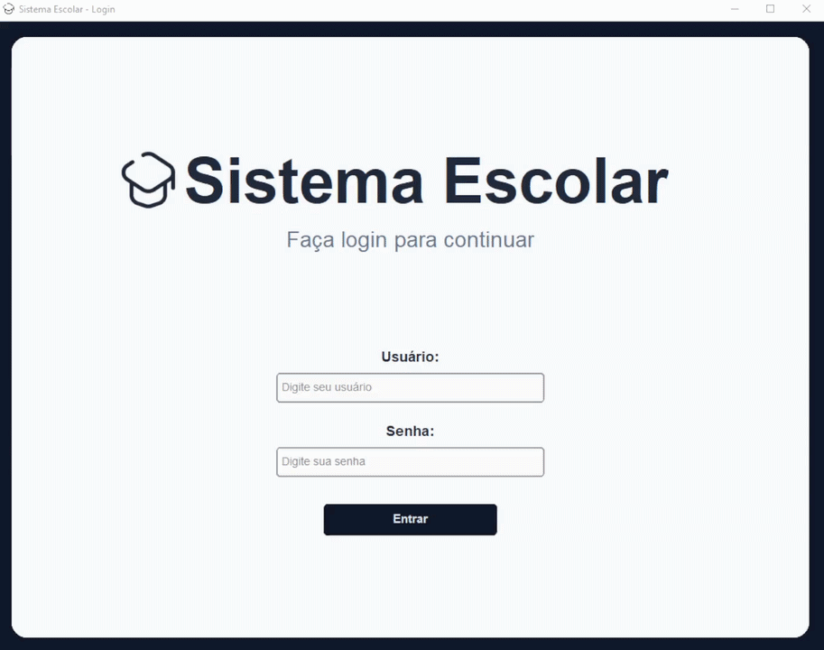
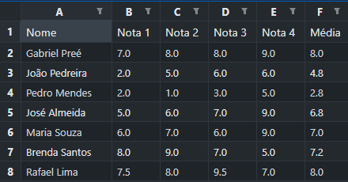
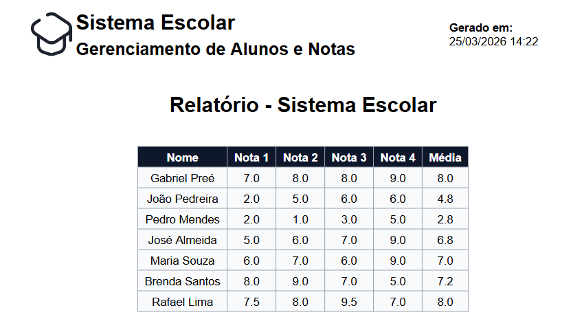

---

## Sobre o Projeto

Sistema desktop completo para gerenciamento escolar desenvolvido em Python, com interface gráfica moderna baseada em CustomTkinter e persistência de dados com SQLite.

O sistema foi projetado com foco em organização, usabilidade e separação de responsabilidades, simulando um ambiente real de gestão escolar com controle de acesso por tipo de usuário.

---

## Demonstração



---

## Principais Funcionalidades

- Cadastro de alunos e professores
- Sistema de autenticação com controle de acesso (admin, professor e aluno)
- Edição completa de registros
- Exclusão com confirmação
- Busca em tempo real
- Cálculo automático de médias
- Validação de notas (0 a 10)
- Alternância entre visão de alunos e professores (admin)
- Exportação de dados para Excel e PDF
- Interface moderna e responsiva

---

## Exportação de Dados

### Excel


### PDF


---

## Tecnologias Utilizadas

- Python 3.10+
- CustomTkinter
- Tkinter (ttk)
- SQLite3
- ReportLab
- OpenPyXL
- Pillow
- bcrypt

---

## Arquitetura do Projeto

O projeto foi estruturado seguindo separação de responsabilidades:

- Interface gráfica isolada
- Camada de banco de dados separada
- Módulo independente para exportações
```
SistemaEscolar/
│
├── SistemaEscolar.py # Interface e lógica principal
├── banco_dados.py # Operações no banco (CRUD)
├── exportar.py # Exportação para PDF e Excel
│
├── escolaBD.db
│
├── README.md
└── requirements.txt
```

---

## Instalação

### 1. Clonar o repositório

```bash
git clone https://github.com/seu-usuario/sistema-escolar.git
cd sistema-escolar
```
### 2. Criar ambiente virtual (recomendado)
```
python -m venv venv
venv\Scripts\activate
```
### 3. Instalar dependências
```
pip install -r requirements.txt
```
### 4. Executar o sistema
```
4. Executar o sistema
```
---

## Controle de Acesso
### O sistema implementa três níveis de usuário:

### Admin:
Gerencia alunos e professores,
pode cadastrar, editar e excluir registros, tem acesso a tabela de alunos e a de professores
### Professor:
Gerencia alunos,
pode editar notas e cadastrar alunos
### Aluno:
Visualiza apenas suas informações

---

## Segurança
- Senhas armazenadas com hash utilizando bcrypt
- Validação de entrada de dados
- Controle de permissões por tipo de usuário

---

## Autor

### Gabriel Preé
Estudante de Análise e Desenvolvimento de Sistemas

Projeto desenvolvido com foco em prática de desenvolvimento GUI, banco de dados e arquitetura de software.

---

## Licença

Este projeto está sob a licença MIT.
Uso livre para fins educacionais e profissionais.
